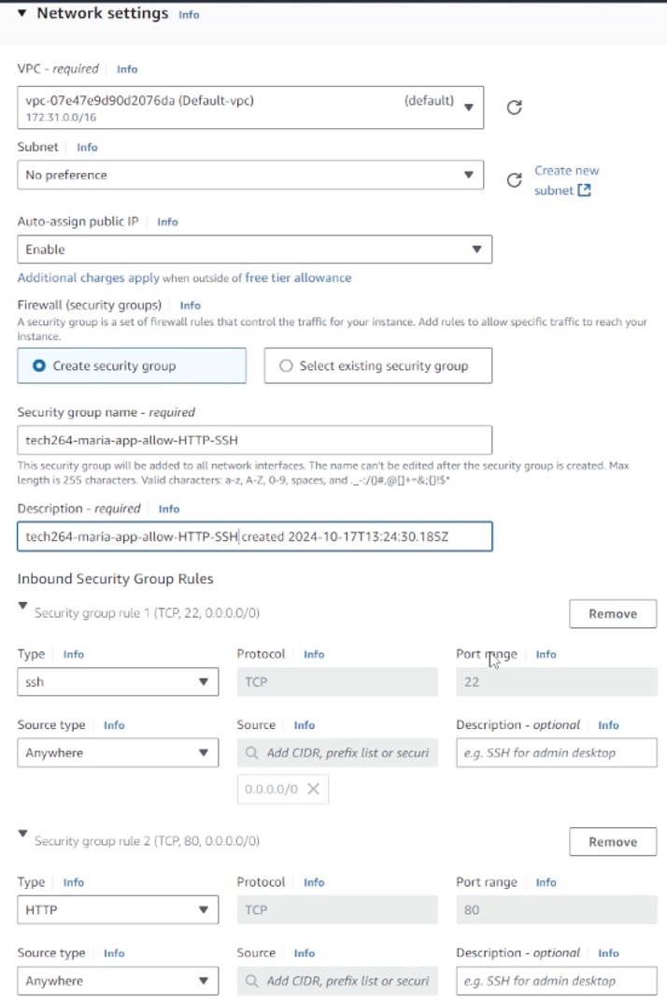

# Task: Re-deploy app in 2-tier architecture on AWS

- Use your scripts to deploy the database + app (with the reverse proxy working)
- Use VM size: `t2.micro` for both your VMs
- Use the default VPC
- Use the naming convention


**Steps**

1.1. **Log into AWS Management Console**
Go to AWS Console.

Select the region to be Ireland.

Navigate to EC2 Dashboard.

1.2. **Launch an EC2 Instance for the App**
1. Click **Launch Instances** in the EC2 dashboard.
2. **Choose an Amazon Machine Image (AMI)**:
   - Select **Ubuntu Server 22.04 LTS** (or similar).
3. **Choose Instance Type**:
    - Select **t2.micro** (eligible for free tier).

4. **Generate a Key Pair**:
    - Create a **new key pair**, download the **.pem** file, and keep it secure. You’ll use this file to SSH into your instances.
    - Take the **.pem** file from download and put it in **.ssh** folder


5. **Configure Instance Details**:
    - **Edit** the **Network settings**
    - Ensure the **Default VPC** is selected.
    - Ensure **Auto-assign Public IP** is enabled (since this will be a public-facing VM).
    - **Create Security Group**:
  
    

**For the app** :
- **Inbound Rules** :
    - **HTTP**: Port 80, Source: Anywhere (0.0.0.0/0)
    - **SSH** : Port 22, Source : Anywhere (0.0.0.0/0)

**For the DB** :
- **Inbound Rules** :
    - **SSH** : Port 22, Source : Anywhere (0.0.0.0/0)
    - **Custom TCP** : Port 27017, Source : Anywhere (0.0.0.0/0)


6. **Configure Storage** : Default
   


7. **Advance details** -> Scroll to User Data :
- **For the database** :
  - Copy and paste your script
- **For the app**:
  - Copy and change the "`export DB_HOST="mongodb://<my-db-vm-private-ip>:27017/posts`" needs to have the Private IP address for the database

Private IP address of database -> Go Instances -> Click on the db instance and copy the Private IP address

8. **Launch**

**To connect the instances with Bash:**

- Navigate to the **instance **
- Click **connect**
  


- Navigate to **SSH client**
- Copy the **path**
- In the **GitBash**
```bash
ssh -i "~/.ssh/<private-aws-key.pem>" ubuntu@ec2-18-201-91-103.eu-west-1.compute.amazonaws.com
```