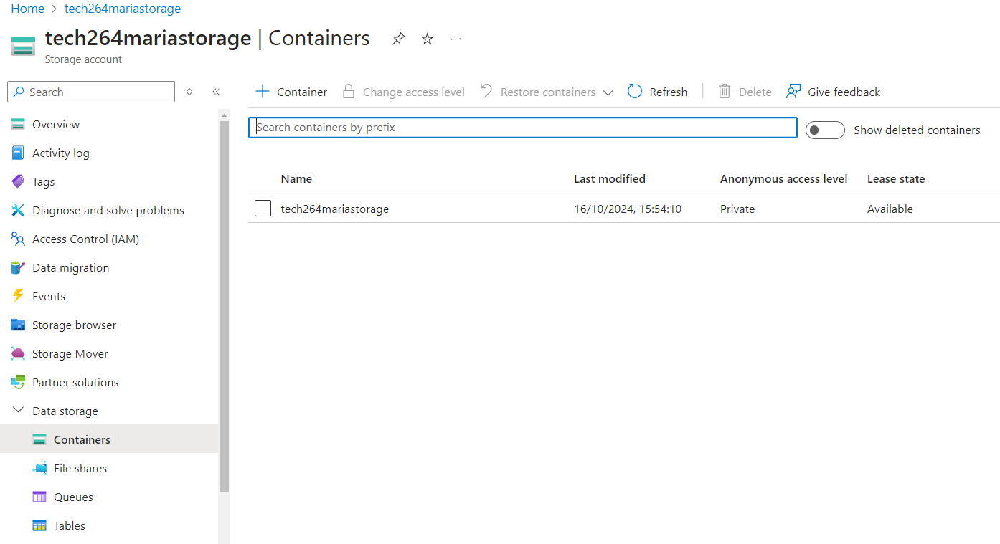

# Azure CLI and Blob Storage

# Blob Storage


# Azure CLI

## Commands
Create a VM and SSH in with the private key already stored in Azure.
1.  Installing Azure CLI
```bash
curl -sL https://aka.ms/InstallAzureCLIDeb | sudo bash
```
2.  Getting Help with Azure CLI
```bash
az --help
```
3.   Login to Azure
```bash
az login
# opens a browser window for you to log in to your Azure account. It authenticates your session, allowing you to run other Azure CLI commands
```
4. List Resource Groups
```bash
az group list
```

5.  Create a Storage Account
```bash
az storage account create --name tech264mariastorage --resource-group tech264 --location uksouth --sku Standard_LRS
```
6.  List Storage Accounts
```bash
az storage account list --resource-group tech264
```
6.  
```bash
az storage account list --resource-group tech264 --query "[].{Name:name, Location:location, Kind:kind}" --output table
```

7.   Delete a Storage Account
```bash
az storage account delete --name tech264mariastorage --resource-group tech264
```

8.  Create a Storage Container
```bash
az storage container create \
  --name tech264mariastorage \
  --account-name tech264mariastorage \
  --auth-mode login
	
```


9.  Delete a Storage Container
```bash
az storage container delete \
    --account-name tech264mariastorage \
    --name testcontainer \
    --auth-mode login
```

# Create a Blob
1.  Create a Text File
```bash
nano texr.txt
```
2.  Display the context of the text.txt
```bash
cat text.txt
```

3.  Upload a Blob to a Container
```bash
az storage blob upload \
    --account-name tech264mariastorage \
    --container-name tech264mariastorage \
    --name newname.txt \
    --file text.txt \
    --auth-mode login
```
4.  List Blobs in a Container
```bash
az storage blob list \
    --account-name tech264mariastorage \
    --container-name tech264mariastorage \
    --output table \
    --auth-mode login
```

In **Azure** -> **Resource Group** -> Search for : **tech264mariastorage**:-> **Data Storage** -> **Containers** ->



**Click** on the "tech264mariastorage" ->


**Click** on the text ->


**Copy the URL** and paste into a new browser ->


We **cant** see because by **default is private**.


To make it **public** need to change the **access level**, by default is private and disabled.


Go to **blob container** -> **Settings** -> **Configuration** -> Look for **Allow Blob anonymous access** -> **Save**


Then Go **Container** -> **Change access level** -> **Blob** or **Container** -> We choose **blob** -> **Save** -> **Refresh the web page**


# Task: Adding an blob image to the Spart test app


az You are going to get a cat picture (jpg) of your choice to display on the Sparta test app front page - the image used will be stored on Azure blob storage.

1. SSH into your Azure VM (make sure VM has the app dependencies installed)
2.  Using the CLI on your VM...
- - Install Azure CLI on your Azure VM - this will give you access to the az command. Use this URL to help: https://learn.microsoft.com/en-us/cli/azure/install-azure-cli
  
```bash
curl -sL https://aka.ms/InstallAzureCLIDeb | sudo bash

```
- -   Login to Azure
```bash
az login
``` 
- - Download a cat picture (jpg) of your choice to your VM - name is downloadedcat.jpg
```bash
wget -O downloadedcat.jpg https://example.com/path/to/cat.jpg
```
- - Upload the cat picture to Azure blob storage into a container called images (Hint: You will first need a storage account + container) - in blob storage the same file should be called uploadedcat.jpg
```bash
az storage account create --name tech264mariastorage --resource-group tech264 --location uksouth --sku Standard_LRS
#create the storage account
```
```bash
az storage container create \
  --name images \
  --account-name tech264mariastorage \
  --auth-mode login
  # create the container called images
```
```bash
az storage blob upload \
  --account-name tech264mariastorage \
  --container-name images \
  --name uploadedcat.jpg \
  --file downloadedcat.jpg \
  --auth-mode login
```
3. Using Azure portal in the web browser of your local machine...
- - Set anonymous Blob access on the storage account

**Set Anonymous Blob Access**
1. Go to the Azure Portal and navigate to your storage account (tech264mariastorage).
2. Under **Settings**, select **Configuration**.
3. Set **Blob public access to Enabled**.
4. Save the configuration.
- - Set access permissions on the container so the uploaded blob can be viewed by the public

1. Back on your VM's CLI...
    - Modify the file index.ejs (found in views folder inside the app folder) - add an  tag to the HTML so display the uploadedcat.jpg image on the Sparta front page.
    - Run the app (no database) to check your blob image displays on the Sparta test app's front page.


2. Screenshot it and document.


**If time:**

- Do step 3 (which you did on the Azure portal) - set blob access and permissions - using Azure CLI commands.
    - Test your commands work by first setting the blob access and permissions back to private
