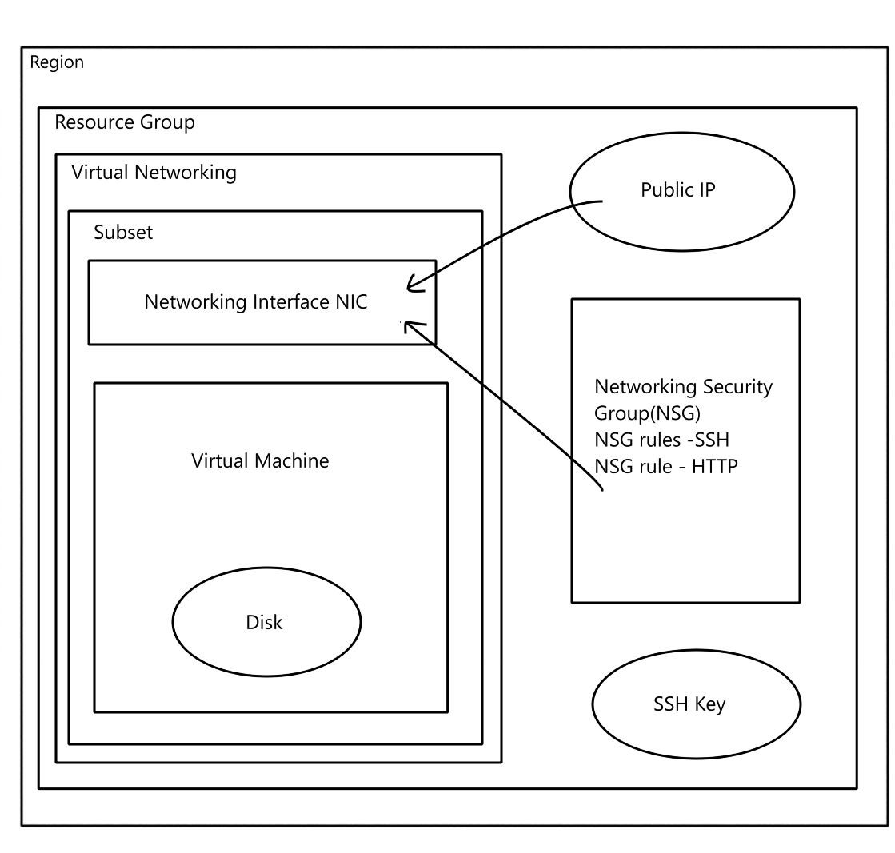

# Learning Cloud Computing - AZURE
- [Learning Cloud Computing - AZURE](#learning-cloud-computing---azure)
- [Cloud Architecture](#cloud-architecture)
  - [Virtual Network (VNet)](#virtual-network-vnet)
  - [Subnet](#subnet)
  - [Resource Group](#resource-group)
  - [Disk](#disk)
  - [Public IP](#public-ip)
  - [NSG Rule - Allow HTTP](#nsg-rule---allow-http)
  - [NSG Rule - Allow SSH](#nsg-rule---allow-ssh)
  - [Region](#region)
  - [SSH Key](#ssh-key)
  - [Network Interface Controller (NIC)](#network-interface-controller-nic)
  - [Virtual Machine (VM)](#virtual-machine-vm)
  - [Network Security Group (NSG)](#network-security-group-nsg)
- [**Steps to Create an SSH Key Pair on a Local Machine and Put the Public Key on Azure**](#steps-to-create-an-ssh-key-pair-on-a-local-machine-and-put-the-public-key-on-azure)
  - [Creating a New SSH Key Pair on a Local Machine](#creating-a-new-ssh-key-pair-on-a-local-machine)
  - [Creating a VNet in Azure](#creating-a-vnet-in-azure)
  - [Setting an SSH key in Azure](#setting-an-ssh-key-in-azure)
- [**Why Create a VNet?**](#why-create-a-vnet)
  - [Details You Need for Planning a VNet:](#details-you-need-for-planning-a-vnet)
    - [CIDR Block:](#cidr-block)
    - [Subnets:](#subnets)
- [Plan to create a VM](#plan-to-create-a-vm)
- [**How to Create a Virtual Machine (VM)**](#how-to-create-a-virtual-machine-vm)
  - [--\> Basic](#---basic)
  - [--\> Disks](#---disks)
  - [--\> Networking](#---networking)
  - [--\> Tags](#---tags)
  - [--\> Review and Create](#---review-and-create)
- [**Connecting Your Virtual Machine**](#connecting-your-virtual-machine)
    - [How to see your SSH key in Git Bash :](#how-to-see-your-ssh-key-in-git-bash-)
- [**Linux commands**](#linux-commands)
- [Linux - research managing file ownership with LInux](#linux---research-managing-file-ownership-with-linux)
    - [**Why is managing file ownership important?**](#why-is-managing-file-ownership-important)
    - [What is the command to view file ownership?](#what-is-the-command-to-view-file-ownership)
    - [What permissions are set when a user creates a file or directory? Who does file or directory belong to?](#what-permissions-are-set-when-a-user-creates-a-file-or-directory-who-does-file-or-directory-belong-to)
    - [Why does the owner, by default, not recieve X permissions when they create a file?](#why-does-the-owner-by-default-not-recieve-x-permissions-when-they-create-a-file)
    - [What command is used to change the owner of a file or directory?](#what-command-is-used-to-change-the-owner-of-a-file-or-directory)
- [Linux - Linux - Research managing file permissions](#linux---linux---research-managing-file-permissions)
    - [Does being the owner of a file mean you have full permissions on that file? Explain.](#does-being-the-owner-of-a-file-mean-you-have-full-permissions-on-that-file-explain)
    - [If you give permissions to the User entity, what does this mean?](#if-you-give-permissions-to-the-user-entity-what-does-this-mean)
    - [If you give permissions to the Group entity, what does this mean?](#if-you-give-permissions-to-the-group-entity-what-does-this-mean)
    - [If you give permissions to the Other entity, what does this mean?](#if-you-give-permissions-to-the-other-entity-what-does-this-mean)
    - [You give the following permissions to a file: User permissions are read-only, Group permissions are read and write, Other permissions are read, write and execute. You are logged in as the user which is owner of the file. What permissions will you have on this file? Explain.](#you-give-the-following-permissions-to-a-file-user-permissions-are-read-only-group-permissions-are-read-and-write-other-permissions-are-read-write-and-execute-you-are-logged-in-as-the-user-which-is-owner-of-the-file-what-permissions-will-you-have-on-this-file-explain)
    - [Here is one line from the ls -l. Work everything you can about permissions on this file or directory.](#here-is-one-line-from-the-ls--l-work-everything-you-can-about-permissions-on-this-file-or-directory)
- [Linux - Research managing file permissions using numeric values](#linux---research-managing-file-permissions-using-numeric-values)
    - [What numeric values are assigned to each permission?](#what-numeric-values-are-assigned-to-each-permission)
    - [What can you with the values assign read + write permissions?](#what-can-you-with-the-values-assign-read--write-permissions)
    - [What value would assign read, write and execute permissions?](#what-value-would-assign-read-write-and-execute-permissions)
    - [What value would assign read and execute permissions?](#what-value-would-assign-read-and-execute-permissions)
    - [Often, a file or directory's mode/permissions are represented by 3 numbers. What do you think 644 would mean?](#often-a-file-or-directorys-modepermissions-are-represented-by-3-numbers-what-do-you-think-644-would-mean)
- [Linux - Research changing file permissions](#linux---research-changing-file-permissions)
    - [What command changes file permissions?](#what-command-changes-file-permissions)
    - [To change permissions on a file what must the end user be? (2 answers)](#to-change-permissions-on-a-file-what-must-the-end-user-be-2-answers)
    - [Give examples of some different ways/syntaxes to set permissions on a new file (named `testfile.txt`) to:](#give-examples-of-some-different-wayssyntaxes-to-set-permissions-on-a-new-file-named-testfiletxt-to)


# Cloud Architecture

## Virtual Network (VNet)
A **Virtual Network (VNet)** provides an isolated network where you can securely deploy and manage resources such as virtual machines (VMs). VNets allow for communication between resources in the same network and can be connected to on-premises networks.

## Subnet
A **Subnet** is a range of IP addresses within a Virtual Network (VNet). Subnets allow you to segment your VNet into smaller networks, helping to organize resources and apply security rules more efficiently.

## Resource Group
A **Resource Group** is a container used to organize and manage related cloud resources such as virtual machines, storage, and networks. It allows for easier management, monitoring, and billing of these resources.

## Disk
A **Disk** in cloud environments is virtual storage attached to a Virtual Machine (VM). Disks store operating systems, applications, and data.


## Public IP
A **Public IP** address allows resources like Virtual Machines (VMs) to communicate with the internet. It provides external-facing connectivity to your cloud resources.

## NSG Rule - Allow HTTP
An **NSG (Network Security Group)** rule to allow HTTP traffic permits inbound and/or outbound web traffic, typically used for web applications. This rule allows public HTTP access to resources like web servers.

## NSG Rule - Allow SSH
An **NSG rule** to allow SSH traffic permits inbound connections, enabling remote access to a Virtual Machine (VM) through a Secure Shell (SSH) protocol.

## Region
A **Region** refers to a geographical location where cloud resources are deployed. Each region consists of multiple data centers and provides redundancy, lower latency, and compliance with data sovereignty regulations.

## SSH Key
An **SSH Key** is a pair of cryptographic keys (public and private) used for secure authentication when accessing Virtual Machines (VMs). The private key is kept by the user, and the public key is stored in the VM.

## Network Interface Controller (NIC)
A **Network Interface Controller (NIC)** is the virtualized hardware that allows a Virtual Machine (VM) to connect to a network. Each NIC is assigned an IP address and provides communication between the VM and other resources.

## Virtual Machine (VM)
A **Virtual Machine (VM)** is a scalable compute resource that runs on virtualized hardware in the cloud. VMs allow users to run applications and workloads without needing to maintain physical servers.

## Network Security Group (NSG)
A **Network Security Group (NSG)** is a set of security rules that control inbound and outbound network traffic to resources in a Virtual Network (VNet), such as Virtual Machines (VMs) and subnets. NSGs help secure cloud environments by allowing or denying traffic based on various criteria.




# **Steps to Create an SSH Key Pair on a Local Machine and Put the Public Key on Azure**

## Creating a New SSH Key Pair on a Local Machine

1. Open a terminal on your local machine.
2. Navigate to home directory `cd ~`
3. Create an ssh directory `mkdir .ssh`
4. Enter the .ssh directory `cd .ssh`
5. Generate an SSH key pair using the following command:
```bash
ssh-keygen -t rsa -b 4096 -f ~/.ssh/mykey
```
- `t rsa:` Specifies the type of key (RSA).
- `b 4096:` Sets the key size to 4096 bits.
- `f ~/.ssh/mykey:` The file name and path to store the keys.
  
This command generates two files:
- `mykey: `The private key (keep this secure, never share it).
- `mykey.pub:` The public key (this is shared with the VM).
  
6. View the public key:
```bash
cat ~/.ssh/mykey.pub
```

## Creating a VNet in Azure

1. Navigate to the Azure portal: https://portal.azure.com.
2. Create a new Virtual Network:
- Search for **"Virtual Network"** > Click **"Create"**.
3. Configure the basic settings for the VNet:
- Choose the resource group.
- Provide a name for the VNet.
- Select a region.
4. Complete the VNet setup:
- Continue through other tabs "IP address" to set network CIDR block represents range of ip addresses and similarly configure subnets.
- Continue through the other tabs "Tags" to assign key value tag to "Owner": "Name"
5. Submition:
- Review and click Create.
  
## Setting an SSH key in Azure

1. Navigate to the Azure portal: https://portal.azure.com.
2. Create a new SSH key:
3. Search for "SSH keys" > Click "Create".
- Configure the basic settings for the VNet:
- Choose the resource group.
- Provide a name for the SSH key.
- Select **"Upload existing public key"**
- Paste the **public** SSH key from your local device. File should end with the `.pub` extension.
4. Complete SSH key setup:
- Continue through the other tabs **"Tags"** to assign key value tag to **"Owner": "Name"**
5. Submition:
Review and click **Create**.

# **Why Create a VNet?**
A Virtual Network (VNet) provides isolated networking for resources in the cloud. VNets allow you to:

- Segment resources using subnets (private or public).
- Control traffic flow with Network Security Groups (NSGs).
- Enable secure communication between on-premises and cloud resources via VPN or ExpressRoute.
- Protect sensitive workloads by keeping traffic internal.

## Details You Need for Planning a VNet:

### CIDR Block:
- Define the IP address range for the VNet, typically in CIDR notation (e.g., 10.0.0.0/16).
### Subnets:
- Divide the VNet into subnets. Each subnet gets its own CIDR block within the VNet’s range.
- Subnets can be classified as public (with external internet access) or private (internal-only).


# Plan to create a VM
- Virtual network + subnet.
- Name.
- Location + pricing.
- Size cpu, memory (RAM) + pricing.
- Storage + pricing.
- OS (concider software compatability) + pricing.
- SSH key pair.


# **How to Create a Virtual Machine (VM)**
## --> Basic
1. **Search** for Virtual Machine on the Azure Portal. 
- Create a new VM : **"Virtual Machine"** > Click **"Create"** > Select **"Azure Virtual Machine"**.
2. Configure the settings for the VM: 
- **Assign** resource group `(tech264)`.
- **Name** the VM `(e.g tech264-<name>-<title>)`
- Set **region** to `(Europe) UK South`.
- Change **availability** to `"No infrastructure redudancy required"`.
- Change **image** to the OS we want on the disc (Also includes flavour and version of the OS, with stuff installed and ready to run - Basically a snapshot of a system). In our case, select `Ubuntu Pro 18.04 - x64 Gen2`. If it is not visible in the immediate recent, click "See all images" and search for it.
- Change **security type** to **standard**.
- Change **size** to `Standard_Bs1 - 1 vcpu, 1 GiB memory`. Select "see all sizes" if not seen in immediate recent.
- Change **username** to to something more secure.
-  Change SSH public key source to `Use existing key stored in Azure`.
-  Select **your** Stored key (e.g tech264..).
-  Select `HTTP (80)` under **select inbound ports**. Both `SHH (22)` and `HTTP (80)` should be selected. You need to set up a certificate to use `HHTPS (443)`.
 
## --> Disks
1. Change OS Disk type to `Standard SSD (locally redundant storage)`.
 
## --> Networking
1. Change the **virtual network** to your own one, as it will default alphabetically.
2. Change **subnet** to `public-subnet`.
3. Enable **Delete public IP and NIC when VM is deleted**. Automates this just in case you forget to do it yourself.
 
## --> Tags
1. Select `Owner : (your name)`.
 
## --> Review and Create
1. Make sure all your details are correct.


# **Connecting Your Virtual Machine**
1. **Start** your virtual machine.
2. Navigate to "Connect" under your VM.
3. Find "Native SSH" and **select** it. A side panel should open.
4. Input `~/.ssh/` and your `private key name` into the "Copy and Execute SSH Command" line. This will output a command for us to use in our CL (We are using **GitBash**).
5. Click the copy button for the code below what was just inputted.
6. Paste this code into your **GitBash**.
7. A **warning** will come out once entered into your **GitBash**. Respond with `yes` and then it will permanently save the IP address, meaning we will not be given the warning again.
8. You can type `exit` to **logout** of the Virtual Machine.-
### How to see your SSH key in Git Bash :
1. home directory : cd .shh
2. ls
3. copy the private key and paste it in the native ssh

# **Linux commands**
* `uname:` - Prints system information like the kernel name. Example: uname might return Linux.
* `uname --help:`- Displays help information for the uname command, showing available options.
* `uname -a:`- Prints all system information, including kernel name, version, hostname, etc. Example output: Linux hostname 5.4.0-42-generic #46-Ubuntu SMP x86_64 GNU/Linux.
* `whoami:`- Prints the username of the current user. Example: If you are logged in as root, whoami will return root.
* `cat /etc/shells:`- Displays the list of available shells on the system. This file typically contains paths to installed shells like /bin/bash.
* `ps -p $$:`- Displays information about the current shell process. The $$ gets the PID (process ID) of the current shell, and ps shows details of that process.
* `history:`- Displays the history of all executed commands in the terminal.
* `!(command number):`- Repeats a specific command from the history. Example: !5 will rerun the 5th command from your history list.
* `history -c:`- Clears the command history of the current session.
* ` ls -a:`- Lists all files and directories, including hidden ones (those starting with a dot .).
* `ls --help:`- Displays help information for the ls command.
* `ls -al:`- Lists all files (including hidden files) in long format, showing file permissions, owner, size, and modification date.
* `. and ..:`-  . refers to the current directory, and .. refers to the parent directory.
* `curl https://cdn.britannica.com/39/7139-050-A88818BB/Himalayan-chocolate-point.jpg --output cat.jpg:` - Downloads a file from the specified URL and saves it as cat.jpg.
* `ls:`-  Lists files and directories in the current directory.
* `ls -l:`-  Lists files in long format, displaying file details (permissions, owner, size, etc.).
* `wget https://cdn.britannica.com/39/7139-050-A88818BB/Himalayan-chocolate-point.jpg -O cat2.jpg:`- Downloads the file using wget and saves it as cat2.jpg.
* `ls:`-  Again, lists the files in the directory after downloading.
* `file cat.jpg:`-  Determines the file type of cat.jpg.
* `mv cat.jpg cat:`-  Renames or moves cat.jpg to cat.
* `ls:`-  Lists files in the directory after renaming.
* `mv cat cat.txt:`- Renames cat to cat.txt.
* `file cat.txt:`- Determines the file type of cat.txt.
* `cp:`- Copy a file from one location to another.
* `rm:`- Removes (deletes) a file.
* `mkdir my pictures:`-  Creates two directories my and pictures because of the space between them.
* `rmdir my:`- Removes the my directory (only if it’s empty).
* `rm -r:`- Removes a directory and its contents recursively.
* `touch chicken-joke.txt:`- Creates an empty file named chicken-joke.txt.
* `nano chicken-joke.txt:`- Opens the chicken-joke.txt file for editing using the nano text editor.
`Ctrl + S:` Save changes.
`Ctrl + X:` Exit nano.
* `head -2 chicken-joke.txt:`-  Displays the first two lines of chicken-joke.txt.
* `tail -2 chicken-joke.txt:`- Displays the last two lines of chicken-joke.txt.
* `nl chicken-joke.txt:`- Displays the contents of chicken-joke.txt with line numbers.
* `cat chicken-joke.txt | grep chicken:`- Searches for the word "chicken" in chicken-joke.txt and displays the matching lines.
* `sudo apt install tree:`- Installs the tree package (a tool to visualize directory structures).
* `sudo apt update -y:`- Updates the package list, automatically confirming with -y.
* `sudo apt install tree:`-  Installs the tree package again (possibly redundant).
* `tree:`- Displays the directory structure of the current folder in a tree format.
* `sudo apt upgrade -y:`- Upgrades all installed packages, automatically 
confirming with -y. **Warnin**g: If packages are already upgraded, this might cause issues.
* `pwd:`- Prints the current working directory.
* `cd /:`- Changes the directory to the root directory.
* `pwd:`- Again prints the current directory, which should now be / (root).
* `.ls:`- Lists the contents of the root directory.
* `cd root:`- Tries to change to the root user’s home directory.
* `sudo su:`-Switches to the superuser (root) account.
* `cd root:`-  Changes to the root user's directory (if logged in as root).
* `ls:`- Lists the contents of the root directory.
* `exit:`-   Exits the root account and returns to the regular user session.


# Linux - research managing file ownership with LInux

### **Why is managing file ownership important?**
* **Security:** It helps control who can access, modify, or execute files. This is important in multi-user systems to prevent unauthorized users from altering sensitive files.
* **Access Control**: Ownership defines which user or group has primary control over a file or directory, allowing proper assignment of read, write, and execute permissions.
* **System Integrity**: Proper ownership ensures that system files are not improperly accessed or modified by unauthorized users, maintaining the stability and security of the system.


### What is the command to view file ownership?
`ls -l` :lists files in the current directory along with details such as file permissions, number of links, owner, group, file size, and modification date


### What permissions are set when a user creates a file or directory? Who does file or directory belong to?
`When a user creates a file or directory, the permissions are typically defined by the system's umask value, which sets default permissions. Common defaults are:`

  * `For **files: rw-r--r-- (644)**` meaning the owner can read and write, while the group and others can only read.
  * `For **directories: rwxr-xr-x (755)**` meaning the owner can read, write, and execute, while the group and others can only read and execute.


### Why does the owner, by default, not recieve X permissions when they create a file?
The owner does not receive execute (x) permissions on a file by default because files are typically created as data files (like text documents), which do not require execution rights. Only executable files, like scripts or programs, need execute permissions. If execute permissions were set by default, it could lead to accidental execution of files that are not meant to be executable, posing a security risk.

### What command is used to change the owner of a file or directory?
```bash
chown <new_owner> <file/directory>
```

# Linux - Linux - Research managing file permissions


### Does being the owner of a file mean you have full permissions on that file? Explain.
No, being the owner of a file does not necessarily mean you have full permissions on that file. Permissions are explicitly defined using the read (r), write (w), and execute (x) flags.The owner of a file can be assigned any combination of these permissions.


### If you give permissions to the User entity, what does this mean?

When you give permissions to the **User** entity (also referred to as the **owner**), you are defining what the owner of the file can do with the file. The owner can be the user who created the file or another user, and their permissions could include:

* **Read (r):** Ability to read the file contents.
* **Write (w):** Ability to modify or delete the file.
* **Execute (x):** Ability to execute the file (only applicable to executable files like scripts or binaries).

### If you give permissions to the Group entity, what does this mean?
When you give permissions to the **Group** entity, you are specifying what users who belong to the file’s group can do. A group is a collection of users, and group permissions define access for all users within that group.


### If you give permissions to the Other entity, what does this mean?
The **Other** entity represents all users on the system who are not the file’s owner and do not belong to the file's group. Permissions assigned to the "Other" entity apply to everyone else.


### You give the following permissions to a file: User permissions are read-only, Group permissions are read and write, Other permissions are read, write and execute. You are logged in as the user which is owner of the file. What permissions will you have on this file? Explain.

If you are the **user (owner)** of the file and have been given read-only permissions, you will only be able to **read** the file. Even though the group and other entities have more extensive permissions (such as write or execute), those do not apply to the owner unless explicitly granted. In this case, since the owner has only read permissions, you cannot write to or execute the file, even though the group and others can.

### Here is one line from the ls -l. Work everything you can about permissions on this file or directory.
```bash
-rwxr-xr-- 1 tcboony staff  123 Nov 25 18:36 keeprunning.sh
```
* **File type**: The first character (-) indicates that this is a regular file (not a directory or special file).

* **Permissions:**
  *   rwx (User/Owner: tcboony): The owner has full permissions: read (r), write (w), and execute (x).
  *   r-x (Group: staff): The group has read (r) and execute (x) permissions, but no write permission.
  *   r-- (Other): Others have read-only (r) permission, without write or execute rights.
  
* **Number of links:** 1 indicates the number of hard links to the file (i.e., references to the same inode).

* **Owner:** The file is owned by the user tcboony.

* **Group:** The file is associated with the group staff.

* **File size**: The file is 123 bytes in size.

* **Modification date**: The file was last modified on Nov 25 at 18:36.

* **Filename**: The file is called keeprunning.sh.

Based on the permissions `(rwxr-xr--)`:

* The owner tcboony can read, write, and execute the file.
* Group members of staff can read and execute the file.
* Others can only read the file.


# Linux - Research managing file permissions using numeric values


### What numeric values are assigned to each permission?
* Read (r): `4`
* Write (w): `2`
* Execute (x): `1`
* No permission: `0`
  
These values can be combined to represent multiple permissions:

* Read + Write (r+w): `4 + 2 = 6`
* Read + Execute (r+x): `4 + 1 = 5`
* Read + Write + Execute (r+w+x): `4 + 2 + 1 = 7`
  
### What can you with the values assign read + write permissions?
To assign read + write permissions, the value 6 is used. This is because:
* Read is `4`
* Write is `2` So, `4 + 2 = 6.`
  
### What value would assign read, write and execute permissions?
To assign read, write, and execute permissions, the value 7 is used. This is because:

* Read is `4`
* Write is `2`
* Execute is `1` So, `4 + 2 + 1 = 7`.
  
### What value would assign read and execute permissions?
To assign read and execute permissions, the value 5 is used. This is because:

* Read is `4`
* Execute is `1` So, `4 + 1 = 5.`
  
### Often, a file or directory's mode/permissions are represented by 3 numbers. What do you think 644 would mean?
When a file’s mode is represented by three numbers, they correspond to the permissions for the `owner (user)`, `group`, and `others` (everyone else), respectively.
* 6: For the `owner`, this means `read + write (4 + 2).`
* 4: For the `group`, this means `read-only (4)`.
* 4: For `others`, this means `read-only (4)`.


# Linux - Research changing file permissions


### What command changes file permissions?
```bash
chmod
```
### To change permissions on a file what must the end user be? (2 answers)
To change permissions on a file, the end user must be either:

* The `owner` of the file.
* A `superuser (root)` with elevated privileges.
  
### Give examples of some different ways/syntaxes to set permissions on a new file (named `testfile.txt`) to:
a.  Set User to read, Group to read + write + execute, and Other to read and write only
- Using symbolic mode:
```bash
chmod u=r,g=rwx,o=rw testfile.txt
```
-  Using numeric mode:
```bash
chmod 764 testfile.txt
```
b. Add execute permissions (to all entities)
- Using symbolic mode:
```bash
chmod a+x testfile.txt
```
- Using numeric mode (this adds +1 to each entity's current permission):
```bash
chmod +x testfile.txt
```
c. Take write permissions away from Group
- Using symbolic mode:
```bash
chmod g-w testfile.txt
```
- Using numeric mode (remove the 2 write bit for the group):
```bash
chmod 750 testfile.txt

```
d. Use numeric values to give read + write access to User, read access to Group, and no access to Other.
- Using numeric mode:
```bash
chmod 640 testfile.txt
```

This gives:
* User: `6` (read + write)
* Group: `4` (read-only)
* Other: `0` (no permissions)
