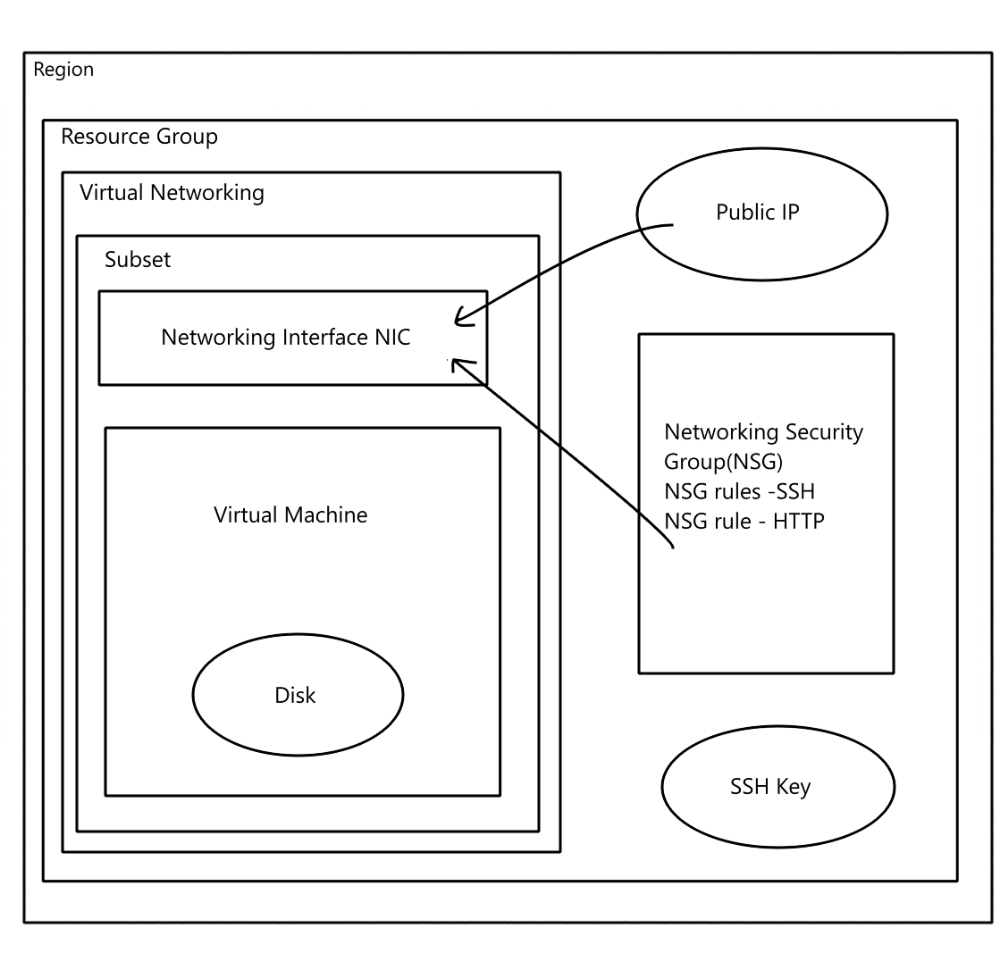

# Cloud Architecture
- [Cloud Architecture](#cloud-architecture)
  - [Virtual Network (VNet)](#virtual-network-vnet)
  - [Subnet](#subnet)
  - [Resource Group](#resource-group)
  - [Disk](#disk)
  - [Public IP](#public-ip)
  - [NSG Rule - Allow HTTP](#nsg-rule---allow-http)
  - [NSG Rule - Allow SSH](#nsg-rule---allow-ssh)
  - [Region](#region)
  - [SSH Key](#ssh-key)
  - [Network Interface Controller (NIC)](#network-interface-controller-nic)
  - [Virtual Machine (VM)](#virtual-machine-vm)
  - [Network Security Group (NSG)](#network-security-group-nsg)
- [**Steps to Create an SSH Key Pair on a Local Machine and Put the Public Key on Azure**](#steps-to-create-an-ssh-key-pair-on-a-local-machine-and-put-the-public-key-on-azure)
  - [Creating a New SSH Key Pair on a Local Machine](#creating-a-new-ssh-key-pair-on-a-local-machine)
  - [Creating a VNet in Azure](#creating-a-vnet-in-azure)
  - [Setting an SSH key in Azure](#setting-an-ssh-key-in-azure)
- [**Why Create a VNet?**](#why-create-a-vnet)
  - [Details You Need for Planning a VNet:](#details-you-need-for-planning-a-vnet)
    - [CIDR Block:](#cidr-block)
    - [Subnets:](#subnets)
- [Plan to create a VM](#plan-to-create-a-vm)
- [**How to Create a Virtual Machine (VM)**](#how-to-create-a-virtual-machine-vm)
  - [--\> Basic](#---basic)
  - [--\> Disks](#---disks)
  - [--\> Networking](#---networking)
  - [--\> Tags](#---tags)
  - [--\> Review and Create](#---review-and-create)
- [**Connecting Your Virtual Machine**](#connecting-your-virtual-machine)
    - [How to see your SSH key in Git Bash :](#how-to-see-your-ssh-key-in-git-bash-)


## Virtual Network (VNet)
A **Virtual Network (VNet)** provides an isolated network where you can securely deploy and manage resources such as virtual machines (VMs). VNets allow for communication between resources in the same network and can be connected to on-premises networks.

## Subnet
A **Subnet** is a range of IP addresses within a Virtual Network (VNet). Subnets allow you to segment your VNet into smaller networks, helping to organize resources and apply security rules more efficiently.

## Resource Group
A **Resource Group** is a container used to organize and manage related cloud resources such as virtual machines, storage, and networks. It allows for easier management, monitoring, and billing of these resources.

## Disk
A **Disk** in cloud environments is virtual storage attached to a Virtual Machine (VM). Disks store operating systems, applications, and data.


## Public IP
A **Public IP** address allows resources like Virtual Machines (VMs) to communicate with the internet. It provides external-facing connectivity to your cloud resources.

## NSG Rule - Allow HTTP
An **NSG (Network Security Group)** rule to allow HTTP traffic permits inbound and/or outbound web traffic, typically used for web applications. This rule allows public HTTP access to resources like web servers.

## NSG Rule - Allow SSH
An **NSG rule** to allow SSH traffic permits inbound connections, enabling remote access to a Virtual Machine (VM) through a Secure Shell (SSH) protocol.

## Region
A **Region** refers to a geographical location where cloud resources are deployed. Each region consists of multiple data centers and provides redundancy, lower latency, and compliance with data sovereignty regulations.

## SSH Key
An **SSH Key** is a pair of cryptographic keys (public and private) used for secure authentication when accessing Virtual Machines (VMs). The private key is kept by the user, and the public key is stored in the VM.

## Network Interface Controller (NIC)
A **Network Interface Controller (NIC)** is the virtualized hardware that allows a Virtual Machine (VM) to connect to a network. Each NIC is assigned an IP address and provides communication between the VM and other resources.

## Virtual Machine (VM)
A **Virtual Machine (VM)** is a scalable compute resource that runs on virtualized hardware in the cloud. VMs allow users to run applications and workloads without needing to maintain physical servers.

## Network Security Group (NSG)
A **Network Security Group (NSG)** is a set of security rules that control inbound and outbound network traffic to resources in a Virtual Network (VNet), such as Virtual Machines (VMs) and subnets. NSGs help secure cloud environments by allowing or denying traffic based on various criteria.




# **Steps to Create an SSH Key Pair on a Local Machine and Put the Public Key on Azure**

## Creating a New SSH Key Pair on a Local Machine

1. Open a terminal on your local machine.
2. Navigate to home directory `cd ~`
3. Create an ssh directory `mkdir .ssh`
4. Enter the .ssh directory `cd .ssh`
5. Generate an SSH key pair using the following command:
```bash
ssh-keygen -t rsa -b 4096 -f ~/.ssh/mykey
```
- `t rsa:` Specifies the type of key (RSA).
- `b 4096:` Sets the key size to 4096 bits.
- `f ~/.ssh/mykey:` The file name and path to store the keys.
  
This command generates two files:
- `mykey: `The private key (keep this secure, never share it).
- `mykey.pub:` The public key (this is shared with the VM).
  
6. View the public key:
```bash
cat ~/.ssh/mykey.pub
```

## Creating a VNet in Azure

1. Navigate to the Azure portal: https://portal.azure.com.
2. Create a new Virtual Network:
- Search for **"Virtual Network"** > Click **"Create"**.
3. Configure the basic settings for the VNet:
- Choose the resource group.
- Provide a name for the VNet.
- Select a region.
4. Complete the VNet setup:
- Continue through other tabs "IP address" to set network CIDR block represents range of ip addresses and similarly configure subnets.
- Continue through the other tabs "Tags" to assign key value tag to "Owner": "Name"
5. Submition:
- Review and click Create.
  
## Setting an SSH key in Azure

1. Navigate to the Azure portal: https://portal.azure.com.
2. Create a new SSH key:
3. Search for "SSH keys" > Click "Create".
- Configure the basic settings for the VNet:
- Choose the resource group.
- Provide a name for the SSH key.
- Select **"Upload existing public key"**
- Paste the **public** SSH key from your local device. File should end with the `.pub` extension.
4. Complete SSH key setup:
- Continue through the other tabs **"Tags"** to assign key value tag to **"Owner": "Name"**
5. Submition:
Review and click **Create**.

# **Why Create a VNet?**
A Virtual Network (VNet) provides isolated networking for resources in the cloud. VNets allow you to:

- Segment resources using subnets (private or public).
- Control traffic flow with Network Security Groups (NSGs).
- Enable secure communication between on-premises and cloud resources via VPN or ExpressRoute.
- Protect sensitive workloads by keeping traffic internal.

## Details You Need for Planning a VNet:

### CIDR Block:
- Define the IP address range for the VNet, typically in CIDR notation (e.g., 10.0.0.0/16).
### Subnets:
- Divide the VNet into subnets. Each subnet gets its own CIDR block within the VNet’s range.
- Subnets can be classified as public (with external internet access) or private (internal-only).


# Plan to create a VM
- Virtual network + subnet.
- Name.
- Location + pricing.
- Size cpu, memory (RAM) + pricing.
- Storage + pricing.
- OS (concider software compatability) + pricing.
- SSH key pair.


# **How to Create a Virtual Machine (VM)**
## --> Basic
1. **Search** for Virtual Machine on the Azure Portal. 
- Create a new VM : **"Virtual Machine"** > Click **"Create"** > Select **"Azure Virtual Machine"**.
2. Configure the settings for the VM: 
- **Assign** resource group `(tech264)`.
- **Name** the VM `(e.g tech264-<name>-<title>)`
- Set **region** to `(Europe) UK South`.
- Change **availability** to `"No infrastructure redudancy required"`.
- Change **image** to the OS we want on the disc (Also includes flavour and version of the OS, with stuff installed and ready to run - Basically a snapshot of a system). In our case, select `Ubuntu Pro 18.04 - x64 Gen2`. If it is not visible in the immediate recent, click "See all images" and search for it.
- Change **security type** to **standard**.
- Change **size** to `Standard_Bs1 - 1 vcpu, 1 GiB memory`. Select "see all sizes" if not seen in immediate recent.
- Change **username** to to something more secure.
-  Change SSH public key source to `Use existing key stored in Azure`.
-  Select **your** Stored key (e.g tech264..).
-  Select `HTTP (80)` under **select inbound ports**. Both `SHH (22)` and `HTTP (80)` should be selected. You need to set up a certificate to use `HHTPS (443)`.
 
## --> Disks
1. Change OS Disk type to `Standard SSD (locally redundant storage)`.
 
## --> Networking
1. Change the **virtual network** to your own one, as it will default alphabetically.
2. Change **subnet** to `public-subnet`.
3. Enable **Delete public IP and NIC when VM is deleted**. Automates this just in case you forget to do it yourself.
 
## --> Tags
1. Select `Owner : (your name)`.
 
## --> Review and Create
1. Make sure all your details are correct.


# **Connecting Your Virtual Machine**
1. **Start** your virtual machine.
2. Navigate to "Connect" under your VM.
3. Find "Native SSH" and **select** it. A side panel should open.
4. Input `~/.ssh/` and your `private key name` into the "Copy and Execute SSH Command" line. This will output a command for us to use in our CL (We are using **GitBash**).
5. Click the copy button for the code below what was just inputted.
6. Paste this code into your **GitBash**.
7. A **warning** will come out once entered into your **GitBash**. Respond with `yes` and then it will permanently save the IP address, meaning we will not be given the warning again.
8. You can type `exit` to **logout** of the Virtual Machine.-
### How to see your SSH key in Git Bash :
1. home directory : cd .shh
2. ls
3. copy the private key and paste it in the native ssh

