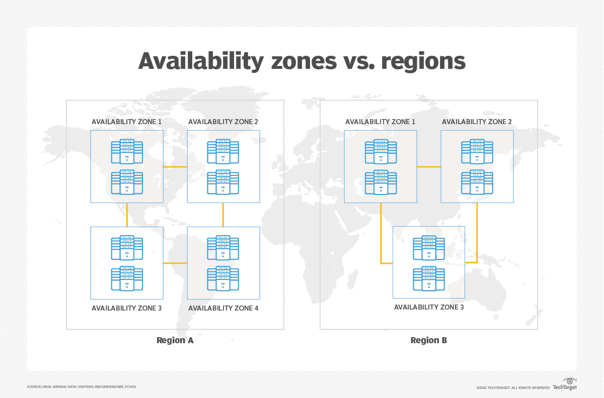

# **Azure**
- [**Azure**](#azure)
- [**The basics of Azure**](#the-basics-of-azure)
  - [Azure regions and availability zones: how they work and include up-to-date diagrams to help](#azure-regions-and-availability-zones-how-they-work-and-include-up-to-date-diagrams-to-help)
  - [Azure regions and availability zones: how they work and include up-to-date diagrams to help](#azure-regions-and-availability-zones-how-they-work-and-include-up-to-date-diagrams-to-help-1)
- [How is Azure structured/organised?](#how-is-azure-structuredorganised)
- [What types of services does Azure provide?](#what-types-of-services-does-azure-provide)
- [Ways to access Azure?](#ways-to-access-azure)
- [Explain the difference between Azure and Azure DevOps](#explain-the-difference-between-azure-and-azure-devops)
- [Why use the Azure Pricing Calculator?](#why-use-the-azure-pricing-calculator)

# **The basics of Azure**
## Azure regions and availability zones: how they work and include up-to-date diagrams to help

- **Regions**: Azure is divided into geographic **regions**, each containing one or more **data centers**. These **regions** are designed to provide** redundancy** and **high availability**, enabling **users** to choose a location closest to their users for optimal performance.
- **Availability Zones**: These are separate physical locations within a **region**, designed to be **isolated from failures** in other zones. Each zone has independent power, cooling, and networking, which increases resilience against outages.
  
## Azure regions and availability zones: how they work and include up-to-date diagrams to help

# How is Azure structured/organised?

- **Resource Groups**: Logical containers for Azure resources (VMs, databases, etc.) to manage permissions and policies collectively.
- Subscriptions: Represents a billing entity; a user can have multiple subscriptions to manage costs and resources separately.
- **Management Groups**: Allows organization of multiple subscriptions for governance and management.
  
# What types of services does Azure provide?
**Compute**:
- Virtual Machines
- Azure Functions (serverless)
- App Services

**Storage**:
- Azure Blob Storage
- Azure File Storage
- Azure Queue Storage

**Networking**:
- Virtual Network
- Azure Load Balancer
- Azure VPN Gateway

**Databases**:
- Azure SQL Database
- Azure Cosmos DB
- Azure Database for PostgreSQL

**AI and Machine Learning**:
- Azure Machine Learning
- Cognitive Services

**DevOps**:
- Azure DevOps (including Repos, Pipelines, Boards)

**Security and Identity**:
- Azure Active Directory
- Azure Security Center
  
# Ways to access Azure?
- **Azure Portal**: A web-based interface for managing Azure services and resources.
- **Azure CLI**: A command-line tool for managing Azure resources from the terminal.
- **Azure PowerShell**: A set of cmdlets for managing Azure resources using PowerShell.
- **REST API**: For programmatic access to Azure services.
- **Azure SDKs**: Libraries for various programming languages to build applications that integrate with Azure.
  
# Explain the difference between Azure and Azure DevOps
**Azure**: A comprehensive cloud computing platform offering a wide range of services for building, deploying, and managing applications.

**Azure DevOps**: A suite of development tools and services designed for software development, including:
- Azure Repos (source control)
- Azure Pipelines (CI/CD)
- Azure Boards (project management)
  
# Why use the Azure Pricing Calculator?
The Azure Pricing Calculator helps users estimate the cost of using Azure services by:
- **Budgeting**: **Users** can input their expected usage to understand potential costs.
- **Comparing** Services: It allows **users** to compare the costs of different services and configurations.
- **Customization**: **Users** can tailor the calculator to their specific needs and scenarios, making it easier to plan and manage budgets.