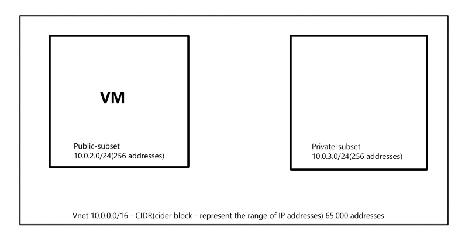

# Planning and creating a Vnet 

**VNet(virtual Network)** -  allows to securely communicate between Azure resources, such as VMs(virtual machines), web apps and databases.

### Details needed to plan/create a VNet

1. **Address Space(CIDR Block)**: 
- decide the IP address range the VNet will cover (e.g. 10.0.0.0/16)

2. **Subnets:** : 
- divide the VNet into subnets            
- each subnet should have its own IP address range
  - **public_subset**t(10.0.2.0/24(256 addresses))
  - **private_subnet**t(10.0.3.0/24(256 addresses))

3. **Regions:** :
- choose the Azure region where the Vnet will be created (e.g Europe Uk south)
  
## How to create a Vnet
1. Search for Vnet
2. Click + create button
3. Set the name of subscription and resource group
4. Set the virtual networking name (e.g tech264-..)
5. Region : (Europe)Uk South
6. Check Security 
7. IP addresses 
- add subsets and set their IP address range(only IPv4): 
  - name
  - starting address
  - size
8. Tags :
   - Name : Owner
   - Value : My name

9. Review + create   
10. Click create
    
