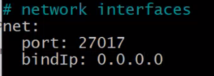

# Learning Linux
- [Learning Linux](#learning-linux)
- [Introduction to Linux](#introduction-to-linux)
- [Linux commands](#linux-commands)
- [How to Write a Bash Script.](#how-to-write-a-bash-script)
- [Linux Environment Variables](#linux-environment-variables)
  - [How to set, view variables](#how-to-set-view-variables)
  - [How to set, view environment variables](#how-to-set-view-environment-variables)
  - [How to make environment variables persistent (for the same user)](#how-to-make-environment-variables-persistent-for-the-same-user)
    - [Step-by-Step to Make a Variable Persistent:](#step-by-step-to-make-a-variable-persistent)
- [Processes](#processes)
  - [Commands to list](#commands-to-list)
  - [Running Processes](#running-processes)
  - [Commands to kill](#commands-to-kill)
  - [why you need to be careful with brute-force kill, what is best to try first and why](#why-you-need-to-be-careful-with-brute-force-kill-what-is-best-to-try-first-and-why)
- [Managing file ownership](#managing-file-ownership)
  - [Why is managing file ownership important?](#why-is-managing-file-ownership-important)
  - [What is the command to view file ownership?](#what-is-the-command-to-view-file-ownership)
  - [What permissions are set when a user creates a file or directory? Who does file or directory belong to?](#what-permissions-are-set-when-a-user-creates-a-file-or-directory-who-does-file-or-directory-belong-to)
  - [Why does the owner, by default, not recieve X permissions when they create a file?](#why-does-the-owner-by-default-not-recieve-x-permissions-when-they-create-a-file)
  - [What command is used to change the owner of a file or directory?](#what-command-is-used-to-change-the-owner-of-a-file-or-directory)
- [Managing file permissions](#managing-file-permissions)
  - [Does being the owner of a file mean you have full permissions on that file? Explain.](#does-being-the-owner-of-a-file-mean-you-have-full-permissions-on-that-file-explain)
  - [If you give permissions to the User entity, what does this mean?](#if-you-give-permissions-to-the-user-entity-what-does-this-mean)
  - [If you give permissions to the Group entity, what does this mean?](#if-you-give-permissions-to-the-group-entity-what-does-this-mean)
  - [If you give permissions to the Other entity, what does this mean?](#if-you-give-permissions-to-the-other-entity-what-does-this-mean)
  - [You give the following permissions to a file: User permissions are read-only, Group permissions are read and write, Other permissions are read, write and execute. You are logged in as the user which is owner of the file. What permissions will you have on this file? Explain.](#you-give-the-following-permissions-to-a-file-user-permissions-are-read-only-group-permissions-are-read-and-write-other-permissions-are-read-write-and-execute-you-are-logged-in-as-the-user-which-is-owner-of-the-file-what-permissions-will-you-have-on-this-file-explain)
  - [Here is one line from the ls -l. Work everything you can about permissions on this file or directory.](#here-is-one-line-from-the-ls--l-work-everything-you-can-about-permissions-on-this-file-or-directory)
- [Managing file permissions using numeric values](#managing-file-permissions-using-numeric-values)
  - [What numeric values are assigned to each permission?](#what-numeric-values-are-assigned-to-each-permission)
  - [What can you with the values assign read + write permissions?](#what-can-you-with-the-values-assign-read--write-permissions)
  - [What value would assign read, write and execute permissions?](#what-value-would-assign-read-write-and-execute-permissions)
  - [What value would assign read and execute permissions?](#what-value-would-assign-read-and-execute-permissions)
  - [Often, a file or directory's mode/permissions are represented by 3 numbers. What do you think 644 would mean?](#often-a-file-or-directorys-modepermissions-are-represented-by-3-numbers-what-do-you-think-644-would-mean)
- [Changing file permissions](#changing-file-permissions)
  - [What command changes file permissions?](#what-command-changes-file-permissions)
  - [To change permissions on a file what must the end user be? (2 answers)](#to-change-permissions-on-a-file-what-must-the-end-user-be-2-answers)
  - [Give examples of some different ways/syntaxes to set permissions on a new file (named `testfile.txt`) to:](#give-examples-of-some-different-wayssyntaxes-to-set-permissions-on-a-new-file-named-testfiletxt-to)
- [Setting the test app with the VM](#setting-the-test-app-with-the-vm)
  - [How to add a port](#how-to-add-a-port)
- [Using SCP (Secure Copy) and how it works](#using-scp-secure-copy-and-how-it-works)
- [Setting the database on a VM](#setting-the-database-on-a-vm)
  - [Creating a VM](#creating-a-vm)
- [Install MongoDB on Azure](#install-mongodb-on-azure)
- [Automating VMs to Run Apps and DBs (Updated with pm2, reverse proxy, run in Azure user data)](#automating-vms-to-run-apps-and-dbs-updated-with-pm2-reverse-proxy-run-in-azure-user-data)
  - [Automating App VM](#automating-app-vm)
  - [Automating DB VM](#automating-db-vm)
- [Task: How many services can use a port?](#task-how-many-services-can-use-a-port)
  - [Resolving Port Conflicts on Linux: Freeing Up Port 3000](#resolving-port-conflicts-on-linux-freeing-up-port-3000)
- [Reverse Proxy](#reverse-proxy)
  - [Manually Configuring Reverse Proxy](#manually-configuring-reverse-proxy)
- [Reverse Proxy Automation.](#reverse-proxy-automation)
- [Task: Run Sparta app in the background](#task-run-sparta-app-in-the-background)
  - [Use pm2 to start and stop the app in your app script](#use-pm2-to-start-and-stop-the-app-in-your-app-script)
    - [pm2: Commands](#pm2-commands)
    - [Automating pm2 to run our app.](#automating-pm2-to-run-our-app)
- [Task: Automate app Stage 3 - Automate app deployment with user data](#task-automate-app-stage-3---automate-app-deployment-with-user-data)
      - [Plan for creating an app + db image](#plan-for-creating-an-app--db-image)
- [Create an Image from a VM](#create-an-image-from-a-vm)
  - [Create a Custom Generalized Image](#create-a-custom-generalized-image)
    - [Prepare the VM for Generalization:](#prepare-the-vm-for-generalization)
    - [Capture the Image:](#capture-the-image)
    - [In the capture image window:](#in-the-capture-image-window)
  - [Creating a New VM from the image](#creating-a-new-vm-from-the-image)
  - [Summary of our Sparta App](#summary-of-our-sparta-app)
- [What should we expect at the public IP after launching our app VM with user data?](#what-should-we-expect-at-the-public-ip-after-launching-our-app-vm-with-user-data)
- [PWD (current directory):](#pwd-current-directory)
  - [pwd](#pwd)

# Introduction to Linux

Linux is a `free` and `open-source operating system` that serves as the foundation for many systems and devices worldwide. It is based on the Linux `kernel`, which was created by Linus Torvalds in 1991. The Linux operating system is widely known for its `stability`, `security`, `flexibility`, and `open-source nature`, making it popular in many environments, from personal computers to servers, supercomputers, embedded systems, and even mobile devices like Android.

# Linux commands
```bash
uname 
```
Prints system information like the kernel name. Example: uname might return Linux.

```bash
uname --help
```
 Displays help information for the uname command, showing available options.

```bash
uname -a
```
Prints all system information, including kernel name, version, hostname, etc. Example output: Linux hostname 5.4.0-42-generic #46-Ubuntu SMP x86_64 GNU/Linux.

```bash
whoami
```
Prints the username of the current user. Example: If you are logged in as root, whoami will return root.

```bash
cat /etc/shells
```
Displays the list of available shells on the system. This file typically contains paths to installed shells like /bin/bash.

```bash
ps -p $$
```
Displays information about the current shell process. The $$ gets the PID (process ID) of the current shell, and ps shows details of that process.

```bash
history
```
Displays the history of all executed commands in the terminal.

```bash
!(command number)
```
Repeats a specific command from the history. Example: !5 will rerun the 5th command from your history list.

```bash
history -c
```
Clears the command history of the current session.

```bash
ls -a
```
Lists all files and directories, including hidden ones (those starting with a dot .).

```bash
ls --help
```
Displays help information for the ls command.

```bash
ls -al
```
Lists all files (including hidden files) in long format, showing file permissions, owner, size, and modification date.

```bash
. and ..
```
. refers to the current directory, and .. refers to the parent directory.

```bash
curl <url> --output <file_name> 
```
Downloads a file from the specified URL and saves it as <file_name>.

```bash
ls
```
Lists files and directories in the current directory.

```bash
ls -l  
```
Lists files in long format, displaying file details (permissions, owner, size, etc.).

```bash
wget <url> -O <file_name>
```
Downloads a file from the internet and saves it as <file_name>.

```bash
file <file_name>
```
Determines the file type of cat.jpg.

```bash
mv <file_name> <new_file_name>
```
Renames or moves a file.


```bash
cp <file_name> <new_file_name>
```
Copy a file from one location to another.

```bash
rm <file_name>
```
Removes (deletes) a file.

```bash
mkdir <directory_name>
```
Creates a new directory; multiple names create multiple directories.


```bash
rmdir <directory_name>
```
Removes an empty directory.

```bash
rm -r
```
Removes a directory and its contents recursively.

```bash
touch <file_name>
```
Creates an empty file or updates the timestamp of an existing file.

```bash
nano <file_name>
```
Opens a file for editing; creates it if it doesn't exist.

`Ctrl + S:` Save changes.
`Ctrl + X:` Exit nano.

```bash
head -<number> <file_name>
```
Displays the first lines of a file.


```bash
tail -<number> <file_name>
```
Displays the last lines of a file.

```bash
nl <file_name>
```
Displays a file with line numbers.

```bash
cat chicken-joke.txt | grep chicken
```
Searches for the word "chicken" in chicken-joke.txt and displays the matching lines.

```bash
cat <file_name>
```
Displays the contents of a file.

```bash
sudo apt install tree
```
Installs the tree package (a tool to visualize directory structures).

```bash
sudo apt update -y
```
Updates the package list, automatically confirming with -y.

```bash
sudo apt install tree
```
Installs the tree package again (possibly redundant).

```bash
tree
```
Displays the directory structure of the current folder in a tree format.

```bash
sudo apt upgrade -y
```
Upgrades all installed packages, automatically 
confirming with -y. **Warning**: If packages are already upgraded, this might cause issues.

```bash
pwd
```
Prints the current working directory.

```bash
cd /
```
Changes the directory to the root directory.

```bash
.ls
```
Lists the contents of the root directory.

```bash
cd root 
```
Tries to change to the root user’s home directory.

```bash
sudo su
```
Switches to the superuser (root) account.


```bash
exit  
```
Exits the root account and returns to the regular user session.


# How to Write a Bash Script.

1. use `nano provision.sh` to begin creating your `provision.sh` file, which will host the script.
2. In the nano interface, write the following lines (be sure to write comments using `#` to help with understanding):
   - `#!/bin/bash`, which i called "**shebang**". This specifies which interpreter should be used to execute the script - so this tells it to use the **Bash** script.
   - `# update` :`sudo apt update -y`
   - `# upgrade` : `sudo apt upgrade -y`
   - `# install nginx` : `sudo apt install -y nginx`
   - `# restart nginx` :`sudo systemctl restart nginx`
   -` # enable nginx - run when start when you start your VM` :`sudo systemctl enable nginx`
3. Save the script by clicking `CTRL+S`, then exit the script by clicking `CTRL+X` to return back to your regular linux CL.
4. 4. Since the default **permissions** do not allow you to execute the script, use `chmod +x provision.sh` to add **execution** **permissions** to the file.
5. Run the script using `./provision.sh`.(the dot . - means the script is in the current direc.)

# Linux Environment Variables 

 An **environment variable** in Linux is a dynamic value that can affect the behavior of running processes. These variables are used to pass information from the shell or system to programs, applications, and scripts.
 
## How to set, view variables
- **Setting a Shell Variable:**
```bash
MYVAR="Hello"
```
- **Viewing a Shell Variable:**
```bash
echo $MYVAR
```
- **Converting a Shell Variable to an Environment Variable:**
```bash
export MYVAR
```
- **Set and Export a Variable in One Command:**
```bash
export MYVAR="Hello"
```

## How to set, view environment variables

- **Set an Environment Variable:**
```bash
export MYENVVAR="World"
```
- **View an Environment Variable:**
```bash
echo $MYENVVAR
```
- **List All Environment Variables**:
```bash
printenv
```
- **View a Specific Environment Variable:**
```bash
printenv MYENVVAR
```
## How to make environment variables persistent (for the same user)
### Step-by-Step to Make a Variable Persistent:
1. Open your .bashrc (or .bash_profile) file using a text editor:
```bash
nano ~/.bashrc
```
2. Add the following line at the end of the file:
```bash
export MYENVVAR="World"
```
3. Save the file and exit the editor (in nano, this is done by pressing `Ctrl + S`, then Enter, and `Ctrl + X` to exit)
4. Apply the changes immediately by running:
```bash
source ~/.bashrc
```
- `echo "export MYNAME=maria_is_persistent" >> .bashrc`
This command appends the line `export MYNAME=maria_is_persistent` to the end of the `.bashrc` file.
  - `>>`: This operator `appends` the text to a file (in this case, .bashrc). If the file does not exist, it will create it.
  - `Effect`: This makes the `MYNAME `environment variable `persistent`. Every time you open a new terminal or start a new shell session, the .bashrc file will be read, and the MYNAME variable will be set to "maria_is_persistent", making it available in future sessions.


# Processes 
 A process is an instance of a running program. Linux provides several commands to list, manage, and terminate these processes. Here’s an overview of useful commands for working with processes and how to handle them carefully.

## Commands to list
1. `ps:` Displays information about active processes.
- basic usage:
```bash
ps
```
- View all system processes:
```bash
ps -A    # or ps -e
```
- Detailed view (including memory and CPU usage):
```bash
ps aux
```
2. `top:` Interactive, real-time view of system processes.
- Shows processes dynamically and updates every few seconds.
- Press `q `to quit.
- You can sort processes by CPU `(Shift+P)` or memory `(Shift+M)` usage, `Shift+N:` Sort by process age.

3. `htop`: A more user-friendly version of `top` (if installed).
```bash
sudo apt install htop  # to install
htop  # to run
```
4. ` jobs`: Lists jobs (background processes) in the current shell session.
```bash
jobs
```

## Running Processes
Run a process for a set time

Example sleep command (Usage: pauses execution for of seconds.)

```bash
sleep <number>
```
To run a process in the background, append an ampersand (&):
```bash
sleep 5000 &
```
## Commands to kill
sleep 5000 & 
1. `kill -1 PID:` Gently terminates a process by its ID (PID).
```bash
kill -1 PID
pid(process ID)
```
sleep 3000 &
2. `kill PID`: Sends a signal to a process, usually to terminate it.
```bash
killall PID
```
sleep 7000 &
3. `kill -9 PID`: Forcibly terminates a process (might create zombie processes).
```bash
kill -9 12345
```

## why you need to be careful with brute-force kill, what is best to try first and why
- `kill -9 (or SIGKILL)` is the most forceful way to terminate a process.
- It does not allow the process to clean up properly. Normally, when a process is killed, it can release resources (like memory, file handles, etc.) and notify other dependent processes. With kill -9, the process is stopped immediately, without any cleanup.
- This can lead to:
  - **Data loss**: If the process was writing to files or performing critical operations.
  - **Zombie processes**: If the parent process isn't notified of the termination, the process may become a "zombie" and stay in the process table until the system reboots or the parent handles it.
  - **Unstable system state:** Especially if the process is a system or critical process.
- What to Try First:
  - `kill -1 PID (SIGHUP):`Hangup
  - `kill PID (SIGTERM):`


# Managing file ownership 

## Why is managing file ownership important?
* **Security:** It helps control who can access, modify, or execute files. This is important in multi-user systems to prevent unauthorized users from altering sensitive files.
* **Access Control**: Ownership defines which user or group has primary control over a file or directory, allowing proper assignment of read, write, and execute permissions.
* **System Integrity**: Proper ownership ensures that system files are not improperly accessed or modified by unauthorized users, maintaining the stability and security of the system.


## What is the command to view file ownership?
`ls -l` :lists files in the current directory along with details such as file permissions, number of links, owner, group, file size, and modification date


## What permissions are set when a user creates a file or directory? Who does file or directory belong to?
`When a user creates a file or directory, the permissions are typically defined by the system's umask value, which sets default permissions. Common defaults are:`

  * `For **files: rw-r--r-- (644)**` meaning the owner can read and write, while the group and others can only read.
  * `For **directories: rwxr-xr-x (755)**` meaning the owner can read, write, and execute, while the group and others can only read and execute.


## Why does the owner, by default, not recieve X permissions when they create a file?
The owner does not receive execute (x) permissions on a file by default because files are typically created as data files (like text documents), which do not require execution rights. Only executable files, like scripts or programs, need execute permissions. If execute permissions were set by default, it could lead to accidental execution of files that are not meant to be executable, posing a security risk.

## What command is used to change the owner of a file or directory?
```bash
chown <new_owner> <file/directory>
```

# Managing file permissions


## Does being the owner of a file mean you have full permissions on that file? Explain.
No, being the owner of a file does not necessarily mean you have full permissions on that file. Permissions are explicitly defined using the read (r), write (w), and execute (x) flags.The owner of a file can be assigned any combination of these permissions.


## If you give permissions to the User entity, what does this mean?

When you give permissions to the **User** entity (also referred to as the **owner**), you are defining what the owner of the file can do with the file. The owner can be the user who created the file or another user, and their permissions could include:

* **Read (r):** Ability to read the file contents.
* **Write (w):** Ability to modify or delete the file.
* **Execute (x):** Ability to execute the file (only applicable to executable files like scripts or binaries).

## If you give permissions to the Group entity, what does this mean?
When you give permissions to the **Group** entity, you are specifying what users who belong to the file’s group can do. A group is a collection of users, and group permissions define access for all users within that group.


## If you give permissions to the Other entity, what does this mean?
The **Other** entity represents all users on the system who are not the file’s owner and do not belong to the file's group. Permissions assigned to the "Other" entity apply to everyone else.


## You give the following permissions to a file: User permissions are read-only, Group permissions are read and write, Other permissions are read, write and execute. You are logged in as the user which is owner of the file. What permissions will you have on this file? Explain.

If you are the **user (owner)** of the file and have been given read-only permissions, you will only be able to **read** the file. Even though the group and other entities have more extensive permissions (such as write or execute), those do not apply to the owner unless explicitly granted. In this case, since the owner has only read permissions, you cannot write to or execute the file, even though the group and others can.

## Here is one line from the ls -l. Work everything you can about permissions on this file or directory.
```bash
-rwxr-xr-- 1 tcboony staff  123 Nov 25 18:36 keeprunning.sh
```
* **File type**: The first character (-) indicates that this is a regular file (not a directory or special file).

* **Permissions:**
  *   rwx (User/Owner: tcboony): The owner has full permissions: read (r), write (w), and execute (x).
  *   r-x (Group: staff): The group has read (r) and execute (x) permissions, but no write permission.
  *   r-- (Other): Others have read-only (r) permission, without write or execute rights.
  
* **Number of links:** 1 indicates the number of hard links to the file (i.e., references to the same inode).

* **Owner:** The file is owned by the user tcboony.

* **Group:** The file is associated with the group staff.

* **File size**: The file is 123 bytes in size.

* **Modification date**: The file was last modified on Nov 25 at 18:36.

* **Filename**: The file is called keeprunning.sh.

Based on the permissions `(rwxr-xr--)`:

* The owner tcboony can read, write, and execute the file.
* Group members of staff can read and execute the file.
* Others can only read the file.


# Managing file permissions using numeric values


## What numeric values are assigned to each permission?
* Read (r): `4`
* Write (w): `2`
* Execute (x): `1`
* No permission: `0`
  
These values can be combined to represent multiple permissions:

* Read + Write (r+w): `4 + 2 = 6`
* Read + Execute (r+x): `4 + 1 = 5`
* Read + Write + Execute (r+w+x): `4 + 2 + 1 = 7`
  
## What can you with the values assign read + write permissions?
To assign read + write permissions, the value 6 is used. This is because:
* Read is `4`
* Write is `2` So, `4 + 2 = 6.`
  
## What value would assign read, write and execute permissions?
To assign read, write, and execute permissions, the value 7 is used. This is because:

* Read is `4`
* Write is `2`
* Execute is `1` So, `4 + 2 + 1 = 7`.
  
## What value would assign read and execute permissions?
To assign read and execute permissions, the value 5 is used. This is because:

* Read is `4`
* Execute is `1` So, `4 + 1 = 5.`
  
## Often, a file or directory's mode/permissions are represented by 3 numbers. What do you think 644 would mean?
When a file’s mode is represented by three numbers, they correspond to the permissions for the `owner (user)`, `group`, and `others` (everyone else), respectively.
* 6: For the `owner`, this means `read + write (4 + 2).`
* 4: For the `group`, this means `read-only (4)`.
* 4: For `others`, this means `read-only (4)`.


# Changing file permissions


## What command changes file permissions?
```bash
chmod
```
## To change permissions on a file what must the end user be? (2 answers)
To change permissions on a file, the end user must be either:

* The `owner` of the file.
* A `superuser (root)` with elevated privileges.
  
## Give examples of some different ways/syntaxes to set permissions on a new file (named `testfile.txt`) to:
a.  Set User to read, Group to read + write + execute, and Other to read and write only
- Using symbolic mode:
```bash
chmod u=r,g=rwx,o=rw testfile.txt
```
-  Using numeric mode:
```bash
chmod 764 testfile.txt
```
b. Add execute permissions (to all entities)
- Using symbolic mode:
```bash
chmod a+x testfile.txt
```
- Using numeric mode (this adds +1 to each entity's current permission):
```bash
chmod +x testfile.txt
```
c. Take write permissions away from Group
- Using symbolic mode:
```bash
chmod g-w testfile.txt
```
- Using numeric mode (remove the 2 write bit for the group):
```bash
chmod 750 testfile.txt

```
d. Use numeric values to give read + write access to User, read access to Group, and no access to Other.
- Using numeric mode:
```bash
chmod 640 testfile.txt
```

This gives:
* User: `6` (read + write)
* Group: `4` (read-only)
* Other: `0` (no permissions)


# Setting the test app with the VM

## How to add a port
1. Navigate to your VM's **network settings**.
2. Open up **Settings** and click **inbound security rules**.
3. Change the **destination port** to `3000`.
4. Change protocol to **TCP**.
5. Change the priority. The **lower** the priority, the **higher** the priority

# Using SCP (Secure Copy) and how it works
The scp command is straightforward and works similarly to the cp command, but allows you to copy files to/from a remote server using SSH.

1. in `GitBash` paste this command
 ```bash
 scp -i /path/to/your/private_key -r /path/to/local/directory username@remote_ip:/path/to/remote/destination/
 #This is the command used to securely copy files or directories between a local machine and a remote machine over SSH.
 ```
1. `connect to the vm using the SSH Key`
2. `ls` : supposed to have :

3. `cd into app`
4. `ls`
5. 
```bash
npm install
```
6. 
```bash
npm audit fix
```
7. 
```bash
npm start
```

# Setting the database on a VM

## Creating a VM
1. Navigate to` portal.azure.com` -> `Virtual machines` -> `+ Create`
2. **Configuration**:
- basics:
  - `subscription` : Azure Training
  - `resource group` : tech264
  - `vm name` :tech264-name-name
  - `region` : Europe South
  - `availability options` : No infrastructure redundancy required
  - `security type`: standard 
  - `image` : Ubantu Pro 22.04 LTS
  - `size `: Standard_B1s- 1 vcpu, 1Gib memory
  - `username`: adminuser
  - `ssh public key sorce`: use existing key stored in Azure
  - `select inbound ports` : SSH(22)
- networking : 
  - `subset` : private-subset
- tags :
  - `name `: owner
  - `value` : "name"
- review and create
- connect : 
  - `connect` -> `native SSH` and paste the SSH key -> copy `the SSH to VM with specified private key `

# Install MongoDB on Azure

**Open GitBash** :

1. `cd .ssh` -> paste the `SSH Key` -> enter
2. `update and upgrade `
-
```bash
 sudo DEBIAN_FRONTEND=noninteractive apt-get update -y
 # DEBIAN_FRONTEND=noninteractive: This environment variable ensures that the command runs in a non-interactive mode, meaning it won't prompt the user for any input during execution. 
```
- 
```bash
sudo DEBIAN_FRONTEND=noninteractive apt-get upgrade -y
```
3.  **From a terminal, install gnupg and curl if they are not already available:**
```bash
sudo apt-get install gnupg curl

# gnupg: stands for GNU Privacy is  used for verifying the authenticity of software packages, signing code, and securing emails using encryption
# curl :  is a command-line tool used to transfer data to or from a server using various protocols such as HTTP, HTTPS, FTP
```

4. **To import the MongoDB public GPG key, run the following command**:
```bash
curl -fsSL https://www.mongodb.org/static/pgp/server-8.0.asc | \
   sudo gpg -o /usr/share/keyrings/mongodb-server-8.0.gpg \
   --dearmor


1.	curl -fsSL https://www.mongodb.org/static/pgp/server-7.0.asc:
•	curl: This is a command-line tool used to download files from the internet.
•	-f: This option makes curl "fail silently" if there’s a server error, meaning it won’t show an error message on the screen.
•	-s: This stands for "silent," which means curl won’t show progress information while downloading.
•	-S: This option ensures that if there is an error, an error message will still be displayed.
•	-L: This tells curl to follow any redirects if the URL changes.
•	https://www.mongodb.org/static/pgp/server-7.0.asc: This is the URL where the MongoDB security key is located.
2.	| (Pipe):
•	This symbol takes the output from the command on the left (the downloaded key) and sends it to the command on the right (the gpg command).
3.	sudo gpg -o /usr/share/keyrings/mongodb-server-7.0.gpg --dearmor:
•	sudo: This stands for "superuser do." It allows you to run commands that require administrative rights.
•	gpg: This is the GNU Privacy Guard, a tool that helps manage security keys and perform encryption.
•	-o /usr/share/keyrings/mongodb-server-7.0.gpg: This option tells gpg where to save the downloaded key file, naming it mongodb-server-7.0.gpg.
•	--dearmor: This option converts the key from its text format (ASCII-armored) to a binary format that’s easier for the system to use.
```

5. **Create the list file for Ubuntu 22.04**:
```bash
echo "deb [ arch=amd64,arm64 signed-by=/usr/share/keyrings/mongodb-server-7.0.gpg ] https://repo.mongodb.org/apt/ubuntu jammy/mongodb-org/7.0 multiverse" | sudo tee /etc/apt/sources.list.d/mongodb-org-7.0.list


1.	echo "deb [...]":
•	echo: This command outputs the text provided within the quotes, which includes the details about the MongoDB repository.
•	"deb [...]": This string defines the new repository, indicating we want to add it to our package sources.
```
6. **Reload the Package Database( to find the latest version)**:
```bash
sudo apt-get update -y
```

7. **Install MongoDB** :
```bash
sudo DEBIAN_FRONTEND=noninteractive apt-get install -y mongodb-org=7.0.6 mongodb-org-database=7.0.6 mongodb-org-server=7.0.6 mongodb-mongosh=2.1.5 mongodb-org-mongos=7.0.6 mongodb-org-tools=7.0.6


#	DEBIAN_FRONTEND=noninteractive:
      # This tells the system to run the command without asking for any user input, which is useful for automation.
```

8. **If this image pops up**: `tab -> enter`


9. **Check if the database is running** :
```bash
sudo systemctl status mongod
```

10. **Start MongoDB** :
```bash
sudo systemctl start mongod
```

11. **Rerun the status command**

12. **Changing the** `bindIp` 
```bash
#By default, MongoDB launches with bindIp set to 127.0.0.1, which binds to the localhost network interface. This means that the mongod can only accept connections from clients that are running on the same machine.

sudo nano /etc/mongod.conf

# change to 0.0.0.0 - means accepting connections from any IP
```


13. **Restart the database:**
```bash
sudo systemctl restart mongod
```

14. **Status the database( to see if is active(running)):**
```bash
sudo systemctl status mongod
```
15. **Check and set the database to start when you start the VM:**
```bash
sudo systemctl is-enabled mongod
#check
```
```bash
sudo systemctl enable mongod
#set
```
16.  `Start the first VM` and open a `new Bash` window without closing the first one  -> `connect the VM` with Bash with `native SSH` -> `enter` -> `ls` -> `cd app` ->[app](app.png) 

17.  **Connect the app to database:**
```bash
export DB_HOST=mongodb://"private IP address":27017/posts
# 27017 - default mongoDB port
# private IP address change with ur private one
```

18. **Check if is set correctly:**
```bash
printenv DB_HOST
```

19. **Connecting to database:**
```bash
npm install
```


20. **Start:**
```bash
npm start
```
21. `Coppy the public IP address from the VM `and paste it into a browser and attach `:3000/posts `

22. **If the page is not seeded:**
```bash
node seeds/seed.js
```

# Automating VMs to Run Apps and DBs (Updated with pm2, reverse proxy, run in Azure user data)

## Automating App VM
Running the below script configures a VM running on Linux Ubuntu 22.04 LTS Gen 2 to run an Application by:

* Updating packages.
* Upgrading packages.
* Installing the NGINX web service.
* Configuring NGINX reverse proxy to divert traffic to port 3000.
* Testing the validity of the configured NGINX file.
* Restarting NGINX to apply changes.
* Installing Node.js v 20_x.
* Checking Node version.
* Installing pm2 (process manager).
* Cloning a git repo by specifying the HTTPS URL.
* Changing directories to point to the app.js file within the repo (within root directory - as the script is run in user data)
* Setting an environment variable (DB_HOST) that is looked up when the app runs.
* Stopping all processes managed by pm2.
* Installing app dependencies and packages.
* Running the app in the background via pm2.

```bash
#!/bin/bash

# Check for updates
echo "update sources list..."
sudo apt update -y
echo "update complete"

# Upgrades those checks
echo "upgrade any packages available..."
sudo DEBIAN_FRONTEND=noninteractive apt upgrade -y
echo "upgrade complete"

# Install nginx
sudo apt install -y nginx
echo "nginx installed"


# Modify Nginx configuration to set up reverse proxy
sudo sed -i 's|try_files $uri $uri/ =404;|proxy_pass http://localhost:3000;|' /etc/nginx/sites-available/default
echo "Nginx reverse proxy configuration updated"

# Test the Nginx configuration
sudo nginx -t

# Restart Nginx
sudo systemctl restart nginx
echo "Nginx restarted with reverse proxy"

echo "install nodejs v20..."
curl -fsSL https://deb.nodesource.com/setup_20.x | sudo -E bash - &&\
sudo DEBIAN_FRONTEND=noninteractive apt-get install -y nodejs

echo "check nodejs version..."
node -v
echo "nodejs v20 installed"

# Install pm2 globally
sudo npm install -g pm2


# Cloning Git repo
echo "Clone Git folder"
git clone https://github.com/corinnai/tech264-sparta-app.git repo
echo "Cloned tech264-sparta-app"


echo "Change directory to app"
cd repo/app
echo "In app directory"

#Set MongoDB connecting string
export DB_HOST="mongodb://10.0.3.5:27017/posts"


# Stop all existing pm2 processes
pm2 stop all

echo "install and run"
npm install
echo npm "install done"


echo "start"
pm2 start app.js
echo "App started with pm2"
```

```bash
sudo sed -i 's|try_files $uri $uri/ =404;|proxy_pass http://localhost:3000;|' /etc/nginx/sites-available/default

sed:
#Stream Editor (sed) is a Unix utility that allows you to search and replace text in files. In this case, it's used to modify the contents of the /etc/nginx/sites-available/default file.

-i:
#This option tells sed to edit the file in place, meaning the changes will be directly written to the file without creating a temporary copy.
```

## Automating DB VM

Running the below script configures a VM running on Linux Ubuntu 22.04 LTS Gen 2 to host a Database by:

* Updating packages.
* Upgarding packages.
* Installing gnupg and curl.
* Download and add MongoDB GPG key for package verification.
* Add MongoDB repository to the sources list.
* Update package list again to include the newly added MongoDB repository
* Install MongoDB version 7.0.6 and specific associated packages.
* Enable MongoDB service.
* Modify MongoDB configuration to allow remote connections.
* Restart MongoDB service to apply configurations

```bash
#!/bin/bash
 
# Update the system package list
echo Updating package list...
sudo apt-get update -y
echo Done!
 
# Upgrade all installed packages to their latest versions
echo Upgrading installed packages...
sudo DEBIAN_FRONTEND=noninteractive apt-get upgrade -y
echo Done!
 
echo Installing gnupg and curl...
sudo apt-get install gnupg curl -y
echo Done!
 
# Download and add MongoDB GPG key for package verification
echo Adding MongoDB GPG key...
sudo rm -f /usr/share/keyrings/mongodb-server-7.0.gpg # Remove key if one exists
curl -fsSL https://www.mongodb.org/static/pgp/server-7.0.asc | sudo gpg --yes -o /usr/share/keyrings/mongodb-server-7.0.gpg --dearmor
echo Done!
 
# Add MongoDB repository to the sources list
echo Adding MongoDB repository to sources list...
echo "deb [ arch=amd64,arm64 signed-by=/usr/share/keyrings/mongodb-server-7.0.gpg ] https://repo.mongodb.org/apt/ubuntu jammy/mongodb-org/7.0 multiverse" | sudo tee /etc/apt/sources.list.d/mongodb-org-7.0.list
echo Done!
 
# Update package list again to include the newly added MongoDB repository
echo Updating package list with MongoDB repository...
sudo DEBIAN_FRONTEND=noninteractive apt-get update -y
echo Done!
 
# Install MongoDB version 7.0.6 and specific associated packages non-interactively
echo Installing MongoDB and related packages...
sudo DEBIAN_FRONTEND=noninteractive apt-get install -y \
    mongodb-org=7.0.6 \
    mongodb-org-database=7.0.6 \
    mongodb-org-server=7.0.6 \
    mongodb-org-shell=7.0.6 \
    mongodb-org-mongos=7.0.6
echo Done!
 
# Start MongoDB service immediately
echo Starting MongoDB service...
sudo systemctl start mongod
echo Done!
 
# Enable MongoDB service to start on boot
echo Enabling MongoDB service to start on boot...
sudo systemctl enable mongod
echo Done!
 
# Modify MongoDB configuration to allow remote connections
echo Configuring MongoDB to allow remote connections...
sudo sed -i 's/127.0.0.1/0.0.0.0/g' /etc/mongod.conf
echo Done!
 
# Restart MongoDB service to apply configurations
echo Restarting MongoDB service...
sudo systemctl start mongod
echo Done!
```


```bash
cat /etc/mongod.conf | grep bindIp  # to check the bindIP
```


# Task: How many services can use a port?

Only one service can use a specific port on a given IP address at a time.

**Error when running another instance of the sparta app.**


## Resolving Port Conflicts on Linux: Freeing Up Port 3000

1. Identify the Process Using Port 3000: Run the following command to find out which process is using port 3000:
   
```bash
sudo lsof -i :<port_number>
```
2. Terminate the Process: Use the kill command with the PID to stop it:
```bash
sudo kill <PID>
```
3. Verify Port Availability (Optional): Run the lsof command again to check if port 3000 is now free:
```bash
sudo lsof -i :<port_number>
```

# Reverse Proxy
A reverse proxy is a server that receives client requests, forwards them to backend servers, and returns the response to the client. It enhances: Load Balancing: Spreads traffic across multiple servers, Security: Hides backend server details and can enforce SSL,Caching

## Manually Configuring Reverse Proxy

Create a back-up for the coonfiguration file
```bash
sudo cp /etc/nginx/sites-available/default /etc/nginx/sites-available/default.bak
```
Edit configuration file in nano text editor
```bash
sudo nano /etc/nginx/sites-available/default
```
Nginx configuration file - How to be adjusted.
```bash
server {
    listen 80;
    server_name your_domain.com;  # Change this to your domain or IP
 
    location / {
        # try_files $uri $uri/ =404; Replace with below
        proxy_pass http://localhost:3000;
    }
}
```
Check if configuration file is valid.
```bash
sudo nginx -t
```
Restart nginx to apply configurations.
```bash
sudo systemctl restart nginx
```

# Reverse Proxy Automation.

Installing NGINX.

```bash
 # Installing the NGINX web service.
echo install nginx...
sudo DEBIAN_FRONTEND=noninteractive apt-get install nginx -y
echo Done!
```

Configuring nginx to reverse proxy (divert traffic) to port 3000.

```bash
# Modifying the nginx configuration file to transfer traffic to port 3000.
echo modifying nginx config file...
sudo sed -i 's/try_files $uri $uri/ =404;/proxy_pass http://localhost:3000;/g' /etc/nginx/sites-available/default
echo Done!
```
Restarting nginx to apply configurations.
```bash
# Restarting nginx to apply configurations
echo restarting nginx...
sudo systemctl restart nginx
echo Done!
```
*Note: Nginx is configured as enabled by default so no need to manually enable the service*

# Task: Run Sparta app in the background

Work out ways to both run, stop and re-start the app in the background (besides using the "&" at the end of the command):

**Issue with using this method when it comes to stopping/re-starting the app**

The issue with managing the state of the app without a process manager is that we would manually have to terminate run the app

## Use pm2 to start and stop the app in your app script

### pm2: Commands
* pm2 : A production process manager that allows you to run your apps in the background, keep them alive (restart automatically if they crash), monitor performance, and handle logs.

* pm2 start npm -- start : Tells PM2 to start a new process using the npm command to execute the start script defined in your package.json. It launches your Node.js application in the background

* pm2 stop npm : If you have multiple processes managed by PM2 that were started with the npm -- start, you can stop them all using this command. This effectively halts the application, but does not remove it from PM2's process list.

* pm2 restart npm : This command restarts the running process associated with the npm command. PM2 will first stop the current instance and then start it again, ensuring any updates or changes are applied.

* Don't forget to install PM2 in your script using sudo npm install -g pm2. The -g installs this globally, meaning we can access PM2 from any terminal window without needing to be in a specific project directory.


### Automating pm2 to run our app.

Installing pm2 (process manager).
```bash
# Installing pm2.
echo installing pm2...
sudo npm install -g pm2
echo Done!
```
If any processes are occupying our ports stop them.
```bash
# Stop all processes managed by pm2
echo Stopping all pm2 processes
pm2 stop all
echo Done!
```
Run our app in the background managed by pm2.
```bash
# Running the app in the background via pm2.
echo running app...
pm2 start app.js
echo app running in the background...
```

# Task: Automate app Stage 3 - Automate app deployment with user data

#### Plan for creating an app + db image
1. Create DB VM using custom image and user data to run entire db script 
2. Test user data did it's job 
3. Create app VM using custom image and user data to run entire app script 
   - make sure the DB_HOST variable has the correct IP
4. Test by:
   - check public IP to bring up app homepage 
   - check /posts page 
5. Create DB VM image from DB VM 
   - delete the db VM
6. Create DB VM from the DB image just created
7. Create app VM image from app VM
   - delete the app VM
8. Create app VM from the app image just created
   - special/shorter (script - run-app-only.sh)
   -  start with she-bang
   - export DB_HOST
   - cd into app folder
   - (probably don't need it) npm install
   - pm2 stop all
   - pm start app.js


Things to consider:

* When running the script in user data it is run within the root directory.
* Meaning the app needs to be accessed from the root directory.

App script :[prov-app-script](prov-app-script.sh)

DB script: [prov-db-script](prov-db-scrpit.sh)


# Create an Image from a VM

## Create a Custom Generalized Image
### Prepare the VM for Generalization:

* SSH into your working database VM (this VM should be fully configured).

* Run the following commands to deprovision and generalize the VM:

```bash
sudo waagent -deprovision+user
```

      
### Capture the Image:
* In the Azure Portal, navigate to the VM you just prepared.
* Click on Capture > Image in the toolbar.

### In the capture image window:
* Enter tech264-firstname-ready-to-run-database-image as the name of the image.
* Select the Resource group for the image.
* Set gallery sharing to > No.
* Check the option to Automatically delete the VM after creating the image.
* Click Review + Create to create the image.
* The new custom generalized image will be created and saved in your selected resource group.

## Creating a New VM from the image
Create a New VM Using the Custom Image:

1. In the Azure Portal, navigate to the resources section.
2. Select the image you created (tech264-firstname-ready-to-run-database-image).
3. Click + Create VM to begin creating a new VM based on this image.

## Summary of our Sparta App

1. We followed the steps of - Create a Custom Generalized Image & Creating a New VM from the image - for our Database VM.
2. We then did the same for the Application VM + we added a script to:
    - Set the DB_Host environment variable that acts as our database connection.
    - Changed directory to point to the app folder.
    - Stopped all existing processes run by pm2.
    - Start the app.js file via pm2

Userdata app script : [userdata-app-scr](userdata-app-scrpit.sh)

# What should we expect at the public IP after launching our app VM with user data?
1. error
2. nginx home page
3. 502 error : bad gateway
4. app displays
```bash
sudo cat /var/log/cloud-init-output.log # command to log the stages of app
```


# PWD (current directory):
## pwd
```bash 
pwd #(current directory)
/home/adminuser/scripts
provision.sh located in your home directory
```
*  When you run `pwd`, it shows the `current directory` you are in, which in this case is `/home/adminuser/scripts`.
* This means you are `inside` the `scripts folder`, which is located under `the adminuser home directory`.

```bash
    ~/provision.sh
``` 
* The` tilde (~)` represents your `home directory` `(/home/adminuser)`, so `~/provision.sh` is a shorthand way of referring to `/home/adminuser/provision.sh`.
* This path points to a file named provision.sh located in your home directory.

```bash
../provision.sh
```
* The `double dots (..)` represent the p`arent directory` of `your current location.`
* Since you're currently in `/home/adminuser/scripts`, `../provision.sh` takes you one level up `(to /home/adminuser)` and points to the provision.sh file there.
* So this is also pointing to `/home/adminuser/provision.sh`.

```bash
/home/adminuser/provision.sh
```
* This is the full (absolute) path to the provision.sh file located in the home directory of the adminuser user.
* It directly points to the file, regardless of your current directory.


