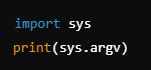

# Script 

## Scripting vs Programming- [Script](#script)
  - [Scripting vs Programming](#scripting-vs-programming)

# Scripting vs Programming
 
## Scripting
- **Complexity:** usually simpler
- **Purpose:** usually to automate simple or routine tasks
- **Execution:** usually by an interpreter
- **Development cycle:** usually shorter
- **Learning curve:** usually easier to learn
 
## Programming
- **Complexity:** usually more complex, often includes more complex logic, data structures, and algorithms
- **Purpose:** much wider purpose, including large applications and games
- **Execution:** either interpreted or needs to be compiled before being run
- **Development cycle:** usually longer and more involved in SDLC phases
- **Learning curve:** usually more involved to learn, including software design patterns

## 1. Difference Between Programming and Scripting

- **Programming:** refers to creating software applications with a focus on structure, algorithms, data structures and more complex functionalities. 
  
- **Scripting:** refers to automating repetitive tasks or controlling other software applications. 

## 2. Running Python Scripts from the Command Line

- Open command line:
    - **navigate to directory**: cd path/to/your/script
    - **run the python script** : python script_name.py
    - **using command line arguments**: python script_name.py arg1 arg2 arg3

In python you can access the arguments using **sys.argv**

## 3. Running Python Scripts from the Command Line

1. Navigating Directories:
    - **ls** (list the files and directories in the current directory)
    - **cd** (change the current directory to the specified path)
    - **pwd** (Prints the working directory, showing where you are in the filesystem)

2. File Management:
    - **touch** (Creates an empty file.)
    - **mkdir new_directory** (Creates a new directory.)
    - 